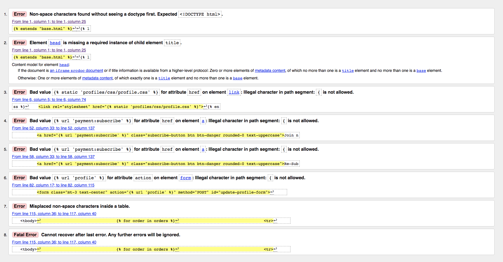

# Deathfret Guitar

## Milestone Project 4 - Full Stack Frameworks with Django

The final project as part of [Code Institute](https://codeinstitute.net)'s full-stack software development course ties together all aspects of full-stack development
in one comprehensive application. Using the Django full-stack framework, the goal is to create an online service app that will be able to handle user authentication as well
as a payment system for a product and/or service.

As a guitarist with over 20 years of experience playing, recording and touring, I have always dreamt of creating a community of up and coming players, in which the more prevalent
who have something to teach will be able to do so for a subscribing user. Specifically, I have been a part of the extreme metal niche of the industry for many years and have observed a gap in this market, and that such a platform does not currently exist for this particular genre.

The Django app is a subscription-based site, where a member will be able to access lessons and masterclasses of talented guitarists for a small monthly, or yearly fee. The site owner(s) are able to source players who would be willing to write and record a lesson series, which will then be available for paying members in their very own members area. At the time of writing, however, this collaborative content has not yet been created, so while the project is being built, only example lesson plans by sourced (Youtube, with permission) players will be used. The structure of the site will, however, remain the same.

The site will also feature a web-store of branded merchandise that a subscribing user or anonymous shopper will be able to purchase. An extra incentive for subscribership is a 10% discount to be used on all branded merchandise.

***

## Contents

1. [UX](https://github.com/vdgvzr/milestone-project-4#ux)
    - [Goals](https://github.com/vdgvzr/milestone-project-4#goals)
    - [Developer Goals](https://github.com/vdgvzr/milestone-project-4#developer-goals)
    - [User Stories](https://github.com/vdgvzr/milestone-project-4#user-stories)
    - [Design](https://github.com/vdgvzr/milestone-project-4#design)
        - [Frameworks](https://github.com/vdgvzr/milestone-project-4#frameworks)
        - [Colours Used](https://github.com/vdgvzr/milestone-project-4#colours-used)
        - [Fonts](https://github.com/vdgvzr/milestone-project-4#fonts)
        - [Icons](https://github.com/vdgvzr/milestone-project-4#icons)
        - [Wireframes](https://github.com/vdgvzr/milestone-project-4#wireframes)
2. [Features](https://github.com/vdgvzr/milestone-project-4#features)
    - [Existing Features](https://github.com/vdgvzr/milestone-project-4#existing-features)
    - [Features Left to Implement](https://github.com/vdgvzr/milestone-project-4#features-left-to-implement)
3. [Testing](https://github.com/vdgvzr/milestone-project-4#testing)
4. [Validation](https://github.com/vdgvzr/milestone-project-4#validation)
    - [HTML](https://github.com/vdgvzr/milestone-project-4#html)
    - [CSS](https://github.com/vdgvzr/milestone-project-4#css)
    - [JavaScript](https://github.com/vdgvzr/milestone-project-4#javascript)
    - [Python](https://github.com/vdgvzr/milestone-project-4#python)
    - [Compatibility](https://github.com/vdgvzr/milestone-project-4#compatibility)
5. [Deployment](https://github.com/vdgvzr/milestone-project-4#deployment)
    - [Deploying The Site](https://github.com/vdgvzr/milestone-project-4#deploying-the-site)
    - [Deploying Locally](https://github.com/vdgvzr/milestone-project-4#deploying-locally)
6. [Technologies Used](https://github.com/vdgvzr/milestone-project-4#technologies-used)
7. [Credits](https://github.com/vdgvzr/milestone-project-4#credits)
    - [Content](https://github.com/vdgvzr/milestone-project-4#content)
    - [Media](https://github.com/vdgvzr/milestone-project-4#media)
    - [Code](https://github.com/vdgvzr/milestone-project-4#code)
    - [Acknowledements](https://github.com/vdgvzr/milestone-project-4#acknowledgements)

***

## UX

### Goals

As part of the Full Stack Developer course directed by [Code Institute](https://codeinstitute.net/), this project was designed to fulfil the scope of creating an e-commerce or SaaS app using the [Django](https://www.djangoproject.com/) full-stack framework.

The main goals of the site are:

    - A platform where users can access valuable lesson series' offered by the talents of the music scene.
    - To create a community of like-minded players who share a passion to share and develop ideas artistically.

The target audience is any guitarist who is interested in learning from the featured artists, but specifically those who are fans of the genre or are interested in learning from it.

The long term goal is to take this project beyond the scope of the course, and after completion, to launch this as my first online business.

### Developer Goals

As a developer, the main goal is to build a subscription model based on signup and paid tiers of subscription. The paid tier will be divided into monthly or yearly payments. If the user opts for the yearly payment option, this will work out cheaper for them annually, rather than paying monthly.

The side goal for this project is to strengthen the knowledge of creating an e-commerce store and the system of one-off payments for goods using [Stripe](https://stripe.com/gb).

Both will strengthen the knowledge and skills of the Django framework gained, and provide the development of advanced JavaScript and Python functionality.

#### Project Challenges

The main challenge posed by the project was the implementation of the subscription system offered by Stripe. The flow and payment intent differs vastly from that of the fixed price payment system, and the challnges faced by keeping webhooks and information seperate from the checkout app, were eventually overcome by a process of following Stripe's Documentation, and building the user data around what is required by Stripe to handle and accept subscription payments.

### User Stories

As a user, I would like to be able to:

#### Viewing and Navigation

- [x] View a list of artist masterclasses so that I can make a decision to subscribe based on whether or not the lessons will be valuable to me.
- [x] View a list of products so that I can select some to purchase.
- [x] View individual product details so I can see the price, detail, size and stock availability of the selected product.
- [x] View the total of my purchases at any time so I can keep track of my spending.

#### Registration and User Accounts

- [x] Register for an account so that I can have access to the content provided.
- [x] Easily login or logout so I can access my personal account information.
- [x] Recover my password in case I forget it.
- [x] Recieve and email confirmation after registering so that I can see that my registration was successful.
- [x] Be able to view a personalised user profile so that I can keep track of my subscription status and personal details.

#### Searching

- [x] Search for a lesson by artist name or description so that I can quickly find the content I need.

#### Purchasing and Checkout

- [x] Easily select which subscription method is best for me so that I can keep track of my spending.
- [x] Easily select the size and quantity of a product, if available, and view at checkout so that I can ensure a correct selection was made before purchase.

***

### Design

The layout and navigation design elements of the site have been achieved using the Bootstrap design framework. As much consideration as possible has gone into implementing the components and altering the styles of each to best suit the overall visual design.

The UX design of the site has been designed as a simple, and easy to use payment flow for both subscription and goods payments. The featured artist and lesson series have been presented to the user in an easy-to-follow style of use, where lessons are laid out in an interactive, self-explanatory way.

#### Subscription Form Layout - Design and Payment flow

The first thing an user will see upon accessing the site, is the subscribe button on the home page. If a user wants to subscribe, they are immediately taken to a subscription payment page where they are clearly given options for what would suit them best. Upon selecting a payment plan, the app JavaScript scrolls the page to the Stripe card element, where the selected plan information is mounted to the card. Upon a successful payment, the user is redirected to their profile page (which will have been set-up by user registration and validation) where the subscription information is clearlt presented. The user can now browse and access the artist lesson series' the site has to offer.

#### Frameworks

* [Django](https://www.djangoproject.com/)
    - The Django framework has provided an excellent, intuitive framework to build this project upon. Offering the ability to easily create data models and to display the data back on the front-end with the use of Django's template tags.

* [Bootstrap 4.5.2](https://getbootstrap.com/)
    - Bootstrap has been chosen as the design framework over others, such as Materialize or Tailwind. Materialize was used in a previous project and resulted in some limitations with the compatibility of other features that were implemented. To keep things simple, Bootstrap provided the ease of use and implementation necessary for the scope of the project.

* [JQuery 3.5.1](https://jquery.com/)
    - Although JQuery has not been a major factor for the use of JavaScript logic in the project, it has played an important role in connecting the front-end interactivity to the back-end functionality. 

#### Colours Used

The colour scheme and brand logo have been designed to reflect the imagery and primary colours that are used throughout most of this genre's visual design work:
    - The logo as a 'band logo' style brand.
    - The use of black, red and white as primary colours observed throughout most extreme metal's visual design work.

Colours:

-  `#000000 - black, base colour`
-  `#FFFFFF - white, base colour`
-  `#DC3545 - red (bootstrap 'danger'), primary colour`
-  `#6C757D - dark grey (bootstrap 'secondary'), secondary colour`

#### Fonts

Many fonts have been experimented with to fit the design of the project, including Google Fonts' "Metal" - which ended up leaving an impression of "tackiness". A cleaner, lighter and smarter font has been chosen, to give the site an air of sophistication and professionalism despite the nature of the genre in which it is based.

Montserrat from [Google Fonts](https://fonts.google.com) has been chosen to reflect the design aesthetic.

#### Icons

[FontAwesome](https://fontawesome.com/) has been used to deliver the icons used throughout the project, as they are the more convenient option to implement alongside Bootstrap.

#### Wireframes

The initial wireframing design was created using [Balsamiq](https://balsamiq.cloud/). The initial design process prioritised the look and feel of the lesson series, as well as the subscription payment flow. The finished design of the project has stayed consistent with the initial desigm, with the exception now that the lessons are presented to the user in accordion functionality.

High-quality wireframes of the site can be found [here](static/deathfret-wireframe.pdf "Wireframes").

***

## Features

### Existing Features

#### 

* Subscription tier page with easy UX flow for taking card payments.

* Merch web-store with easy UK flow for taking card payments.

* User profile containing current subscription status, default delivery information and order history.

* Lesson sets laid out in a Bootstrap accordion.

### Features Left to Implement

* Instagram feed for a local feature wall - something that was implemented during the project but made redundant due to the nature of Instagram's API being changed.

* A news blog related to the community that will be built by app users.

* Downloadable course content (music sheets and backing tracks) in PDF and mp3 format.

* Gain access key from Google to complete the social media login functionality. This requires registration of a finished site and domain.

***

## Manual Testing

### Creating an Account

To test the full user functionality of the site, first, a superuser account was created using the handle() function inside makesuper.py. This can be called in the terminal by using the following command:

    - `python3 manage.py makesuper`

This account can log in, and access the Django admin templates.

A test account was then created as a simulation of an anonymous user. The login forms were tested by intentionally providing an email address without the proper syntax, and a password deemed too short by the form constraints. After signing up successfully, the user can confirm this after email validation by navigating to the user's profile page and observing the Signup Free 'ACTIVE' status within the profile's subscription information.

### Signing up to a Subscription

The subscription stripe element is resilient against incorrect card information, and will not create a subscription without first having a subscription tier selected. Stripe's test payment card information has been used to start a subscription for the test user. This can be done by using either:

    - `4242 4242 4242 4242`

for direct payment, or:

    - `4000 0000 0000 3220`

to enable Stripe's 3D payment authentication.

Upon successful payment, the user is redirected to their profile page, where the subscription status should read 'PAID'. This will now allow the user to view all of the lesson content.

### Cancelling a Subscription

Cancelling a user's subscription is as simple as clicking the 'Cancel Subscription' button found in the user profile's subscription information. The subscription will immediately be cancelled.
Further functionality to this would be to implement an automatic refresh of the profile page upon clicking cancel, so the status of the subscription correctly reads 'CANCELED' without the user having to exit the profile page or manually refresh.

### Updating a Subscription

If a user has a paid subscription, all 'subscribe' buttons visible throughout the site will now read 'change subscription'. This will still bring the user to the subscription payment page, where they will first have to cancel their current subscription to change their subscription by subscribing to a new tier.

### Purchasing a Merch Item

The payment flow has been tested both as an anonymous user, and a registered user. All items, quantity and sizes flow correctly. The update and delete CRUD operations on the cart contents also pose no issues.

### Viewing a Masterclass

### Responsiveness

Using Bootstrap simplified the responsiveness process thanks to the grid system and responsive based text classes. I have utilised this system with minimal use of media queries.

To test responsiveness, Google Chrome's developer tools have been used to ensure the site works across all screen sizes, from desktop computers down to mobile.

### Known Bugs and Issues

*  Cancelling a subscription does not currently cause a page redirect or refresh.

***

## Validation

### HTML

* [HTMLValidator](https://validator.w3.org/)
    - All HTML passes through the validator without any problems. The only errors present are raised for the Django template tags:

### CSS

* [CSSValidator](https://jigsaw.w3.org/css-validator/)
    - All static CSS files pass through the validator with no errors.

### JS

* [JavaSciptValidator](https://esprima.org/demo/validate.html)
    - All static JS files pass through the validator with no errors.

### Python

* [PythonCodeChecker](https://extendsclass.com/python-tester.html)
    - All Python code passes through the code checker with no major errors. The only errors present here and on flake8 are things not worth changing, eg. line length.

### Compatibility

* To test the site based on different platforms, I used [Cross Browser Platforms](https://app.crossbrowsertesting.com/) to view the look and feel of the site on multiple platforms.
    - The site was tested throughout development using Google Chrome.
    - No other issues with elements appear present. The functionality works fine.

***

## Deployment

### Deploying The Site

To deploy the app on Heroku, the following steps have been followed:

1. Log into Heroku, and create a new app by providing the app name and the nearest location of deployment.

2. Under the resources tab, provision the Heroku Postgres database as a new Add-on. This will be used as the deployment database.

3. To use Heroku Postgres, in the terminal, install `dj_database_url` and `psycopg2-binary`.

4. Freeze all app requirements to and create a requirements.txt file. This tells Heroku which requirements to use for deployment.

    - `pip3 freeze > requirements.txt`

5. To set up the new Postgres database, `import dj_database_url` in the project level settings.py file and set the new database default to the Heroku database config variable. Once in place, run migrations.

6. Once the migration has occurred, revert the default database setting to the original and set up a conditional so that if the DATABASE_URL exists in the Heroku environment, use Postgres, otherwise, use a local database.

7. Install `gunicorn` as the project web server and freeze to requirements.txt.

8. Create the Heroku Procfile (`touch Procfile`) which will run gunicorn as the server for the app.

    - `web: gunicorn <app_name>.wsgi:application`

9. Log into Heroku in the terminal (`heroku login -i`), and disable the app's collect static so that Heroku will not collect the static files.

    - `heroku config:set DISABLE_COLLECTSTATIC=1 --app <app_name>`

10. Add `<app_name>.herokuapp.com` to ALLOWED_HOSTS in settings.py.

11. Finally, set the git remote and push the repository to deploy to Heroku:

    - `heroku git:remote -a <app_name>`
    - `git push heroku master`

12. To complete deployment, connect the git repository to Heroku to allow git to push to Gitpod and Heroku simultaneously. Add new environment variables for SECRET_KEY and DEVELOPMENT and add those into settings.py.

### Deploying Locally

1. Ensure the following components are present:

    - [Git](https://gist.github.com/derhuerst/1b15ff4652a867391f03)
    - [pip](https://pip.pypa.io/en/stable/installing/)
    - [Python3](https://www.python.org/downloads/)
    - [Django](https://www.djangoproject.com/)

2. Download the .zip file from the repository in GitHub. The following command can also be used to clone the repository:

    - `git clone https://github.com/vdgvzr/milestone-project-4`

3. In the workspace environment, ensure that all Django config variables are set.

4. Install the project requirements from the requirements.txt file:

    - `pip3 install -r requirements.txt`

5. Run the manage.py file to run the server:

    - `pip3 manage.py runserver`

***

## Technologies Used

* [Github](https://www.github.com/) - Used for hosting and version control.
* [GitPod](https://www.gitpod.io/) - Online code editor.
* [Django](https://www.djangoproject.com/) - Web framework used.
* [Django Allauth](https://django-allauth.readthedocs.io/en/latest/installation.html) - Authentication framework used.
* [Django Crispy Forms](https://django-crispy-forms.readthedocs.io/en/latest/) - Used for all form styling.
* [DjStripe](https://github.com/dj-stripe/dj-stripe) - Used to integrate the Stripe subscription Products with the Django SQLite3 database.
* [Heroku and Postgres](https://www.heroku.com/) - Used for app and database deployment.
* [HTML5](https://en.wikipedia.org/wiki/HTML5) - Used for the templates.
* [CSS](https://en.wikipedia.org/wiki/Cascading_Style_Sheets) - For adding styles to html elements.
* [Javascript](https://en.wikipedia.org/wiki/JavaScript) - Used to write functions for site interactivity.
* [Python](https://www.python.org/download/releases/3.0/) - Used for writing app functions and to communicate with mongoDB using pymongo.
* [JQuery](https://jquery.com/) - Ussed to access elements between languages.
* [Bootstrap4](https://getbootstrap.com/) - Design framework.
* [Balsamiq](https://www.balsamiq.com/) - Used for wireframe design.
* [HTMLValidator](https://validator.w3.org/) - For testing html code validity.
* [CSSValidator](https://jigsaw.w3.org/css-validator/) - For testing css code validity.
* [JavaScriptValidator](https://esprima.org/demo/validate.html) - For testing js code.
* [PythonCodeChecker](https://extendsclass.com/python-tester.html) - For testing python code.
* [Favicon](https://www.favicon-generator.org/) - For creating site favicon.
* [GoogleFonts](https://fonts.google.com/) - For providing fonts for the site.
* [AmIResponsive?](http://ami.responsivedesign.is/) - To test site responsiveness.
* [Stripe](https://stripe.com/gb) - To process payments.
* [YouTube](https://www.youtube.com) - For embedded lesson videos.
* [Instagram](https://www.instagram.com) - For embedded features. `(now redundant)`

***

## Credits

### Content

- All content has been written by myself, except for the artist and lesson descriptions which have been written by each artist, respectively.

### Media:

* The Deathfret brand logo was designed by a personal friend, for use here.
* Index carousel images have been sourced as copyright-free images from [Adobe Stock](https://stock.adobe.com/uk/).
* Merch items created by myself using [Custom Ink](https://www.customink.com/).
* All credit for lesson videos goes to the sourced artists:
    - [Kevin Goetz](https://www.youtube.com/user/MuteProphetBand)
    - [Jason Stallworth](https://www.youtube.com/c/jasonstallworth/playlists)
    - [Simon Smith](https://www.youtube.com/user/simonthedragon)
    - [Corey Hunter](https://www.youtube.com/user/gsogoz)

### Code

- The Deathfret merch store app coding content has been inspired by what has been learned about Django full-stack frameworks thanks to the Full-Stack Development module provided by [Code Institute](https://codeinstitute.net/), allowing room to further demonstrate an understanding of the framework for the subscription app.
- This article from [Ordinary Coders](https://www.ordinarycoders.com/blog/article/django-stripe-monthly-subscription) provided valuable insight into how to integrate the Stripe subscription API with this app.

### Acknowledgements

Special thanks go to :

- The Code Institute mentoring team, for their patience and expertise.
- My mentor, Mark Railton for his support and encouragement.
- The Code Institute Slack community for their knowledge and quick responses.

This site is for educational use only.

Shaun Lindsley/vdgvzr

Code Institute 2020